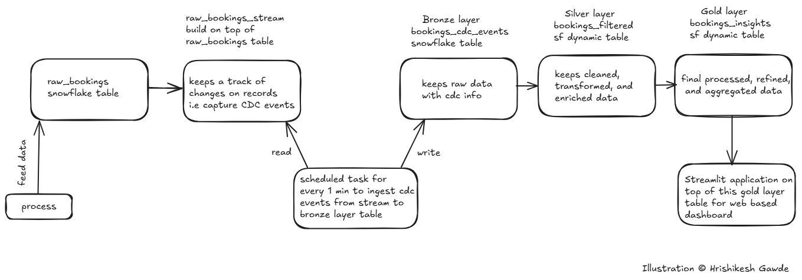
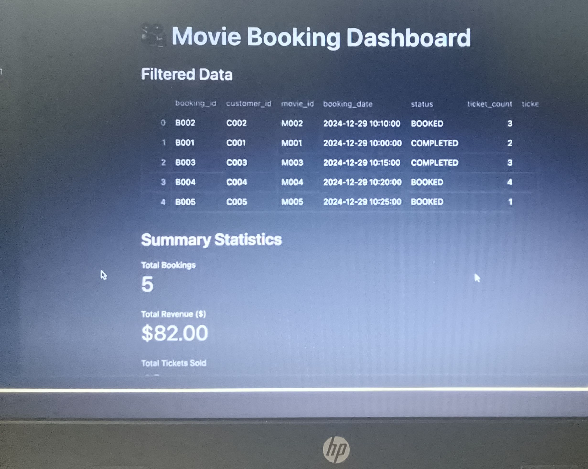

# Movie Bookings Real Time CDC Data Pipeline with Medallion Architecture in Snowflake

## Introduction
This project demonstrates a real-time Change Data Capture (CDC) data pipeline for movie bookings using Snowflake’s features such as Dynamic Tables, Streams, and Tasks. It follows the Medallion Architecture pattern (Bronze, Silver, Gold layers) and concludes with a real-time Streamlit dashboard built on top of the refined, aggregated data in the Gold layer. The project showcases Snowflake’s modern capabilities for real-time data ingestion and transformation with minimal operational overhead.

## Problem Statement
In modern ticket-booking platforms, keeping track of live bookings, cancellations, and completions is essential for business insights. Batch processing of this data leads to delays in reporting and lost opportunities for timely decision-making. This project aims to solve that by implementing a real-time CDC pipeline that captures booking events, processes them incrementally through well-defined Medallion layers, and serves up actionable insights instantly through a dashboard.

## Architecture
The project architecture leverages Snowflake’s native features for CDC and transformation using a layered approach with medallion architecture, as shown below:

## Technology Used
- Python
- Snowflake Stream
- Snowflake Task
- Snowflake Dynamic Table
- Streamlit (Snowflake Native App)
- Snowpark for Python

## Dataset Used
#### Input Data
raw_movies_booking: booking_id, customer_id, movie_id, booking_date, status, ticket_count, ticket_price

#### Bronze Layer
movies_booking_cdc_events: booking_id, customer_id, movie_id, booking_date, status, ticket_count, ticket_price, change_type, is_update, change_timestamp

#### Silver Layer
movies_booking_filtered: booking_id, customer_id, movie_id, booking_date, status, ticket_count, ticket_price, latest_change_timestamp

#### Gold Layer
movies_booking_insights: movie_id, total_bookings, total_tickets_sold, total_revenue, total_cancellations, refresh_timestamp

## Scripts for Project
- snowflake_dynamic_tables.sql: SQL worksheet that defines the entire CDC pipeline using Snowflake features:
  - Create raw movies booking table
  - Setup stream on raw table
  - Create Bronze layer table with CDC metadata
  - Task to ingest incremental data to Bronze every 1 minute
  - Create Silver layer dynamic table for filtered records
  - Create Gold layer dynamic table with aggregated insights
  - Task to refresh Gold table every 2 minutes
  - 
- streamlit_app.py: Streamlit application built using the Snowpark library to create a real-time web-based dashboard for stakeholders using data from the Gold layer.

## Output 
- Real-time ingestion and tracking of booking changes using Snowflake Stream.
- Incremental processing of data through Bronze → Silver → Gold Medallion layers.
- Aggregated metrics such as total bookings, revenue, and cancellations available in near real-time.
- Fully interactive dashboard using Streamlit displaying insights for business stakeholders.
- System refreshes every 1–2 minutes with no external orchestration tools.

## Buisness Impact
Businesses can leverage near real-time metrics such as `total_bookings`, `total_revenue`, and `total_cancellations` to make timely decisions. These insights help monitor booking trends, identify high-demand movies, detect sudden spikes in cancellations, and adjust marketing or pricing strategies dynamically—ultimately improving operational efficiency and maximizing revenue.

## My Learnings
- Practical understanding of Medallion Architecture implementation inside Snowflake.
- Hands-on experience with Snowflake Streams and Scheduled Tasks for incremental ingestion.
- Usage of Dynamic Tables for continuous transformation and aggregation logic.
- Built and deployed a real-time dashboard using Streamlit inside Snowflake using Snowpark.
- Gained insights into CDC data modeling and layering best practices for analytics pipelines.

